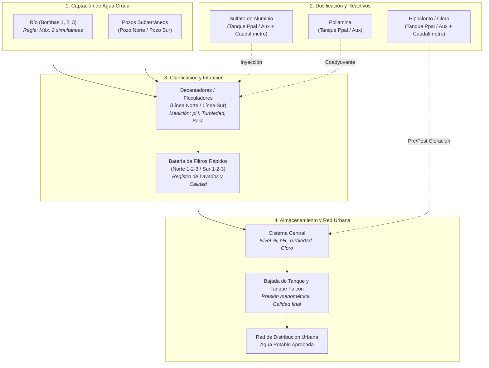

# SISTEMA INTEGRAL DE GESTIÓN Y CONTROL DE PLANTA POTABILIZADORA (AGUAS)
## DOCUMENTACIÓN TÉCNICA, ARQUITECTURA DEL SISTEMA Y MANUAL DE OPERACIÓN

---

## 1. FICHA TÉCNICA DEL PROYECTO

| Parámetro | Especificación |
| :--- | :--- |
| **Nombre del Sistema** | AGUAS - Sistema Integral de Planta Potabilizadora |
| **Repositorio Git** | `https://github.com/titotroffe/AGUAS.git` |
| **Framework Backend** | Laravel 11 / 12 (PHP 8.3+) |
| **Módulo de Autenticación** | Laravel Breeze (Blade Stack) |
| **Base de Datos** | MySQL / MariaDB (Compatible con SQLite en testing) |
| **Frontend & UI** | Blade Templates, Tailwind CSS, Alpine.js, Chart.js, FontAwesome 6 |
| **Patrón Arquitectural** | MVC (Model-View-Controller) + EAV (Entity-Attribute-Value para Laboratorio) |
| **Comunicación en Tiempo Real** | Polling HTTP asíncrono (AJAX / Fetch API cada 15s) |
| **Modelo de Permisos** | RBAC (Role-Based Access Control) con aprobación jerárquica |

---

## 2. INTRODUCCIÓN Y OBJETIVOS DEL SISTEMA

El sistema **AGUAS** es una plataforma web integral diseñada para la digitalización, supervisión operativa y control de calidad en tiempo real de una planta de tratamiento y distribución de agua potable.

### Objetivos Principales:
1. **Telemetría y Control de Bombeo**: Monitoreo y accionamiento del parque de bombas de captación de agua cruda (río) y pozos subterráneos, aplicando reglas de seguridad física (enclavamiento de máximo 2 bombas de río simultáneas).
2. **Supervisión de Presiones y Almacenamiento**: Registro continuo de presiones hidráulicas en puntos estratégicos (Bajada de Tanque, Planta de bombeo, Tanque de Falcón) y porcentaje de llenado de cisterna.
3. **Mantenimiento Operativo (Batería de Filtros)**: Trazabilidad de ciclos de retrolavado en las baterías de filtros rápidos (Línea Norte y Línea Sur) para prevenir colmatación y asegurar caudales óptimos.
4. **Dosificación y Almacenamiento Químico**: Control de existencias porcentuales en tanques principales y auxiliares de reactivos críticos: Sulfato de Aluminio (coagulante), Poliamina (floculante) e Hipoclorito de Sodio / Cloro (desinfectante), junto con la lectura de caudalímetros de inyección ($m^3/h$).
5. **Control de Calidad en Línea y Laboratorio Central**:
   - Monitoreo fisicoquímico operativo en tiempo real (pH, turbiedad en NTU, cloro residual libre en mg/L) en 7 puntos de la línea de tratamiento.
   - Ensayos bacteriológicos rápidos (*Escherichia coli* y Coliformes Totales).
   - Ensayos analíticos profundos de laboratorio mediante un esquema dinámico EAV (toxicología, metales pesados, calidad de materias primas recibidas, control de pozos).
6. **Trazabilidad y Libro de Guardia Digital**: Registro inmutable de novedades por turno con acuse de recibo y marcas de tiempo por usuario.
7. **Business Intelligence para Jefatura**: Tableros de mando interactivos con curvas de tendencias históricas, conteo de mantenimiento preventivo y administración de credenciales y roles del personal.

---

## 3. ARQUITECTURA GENERAL Y FLUJO DEL TRATAMIENTO

### 3.1. Diagrama de Flujo Físico e Hidráulico del Proceso



---

## 4. ROLES DE USUARIO Y MATRIZ DE PERMISOS (RBAC)

El acceso al sistema está controlado por el middleware `App\Http\Middleware\CheckRole`. Además, toda cuenta nueva creada requiere aprobación explícita de Jefatura (`is_approved = 1`).

| Módulo / Funcionalidad | Operador | Químico | Laboratorio | Jefatura | Admin |
| :--- | :---: | :---: | :---: | :---: | :---: |
| **Acceso a Menú Central** | Sí | Sí | Sí | Sí | Sí |
| **Control Bombas/Pozos (Accionar Switches)** | **Sí** | No (Solo Lectura) | No | **Sí** | **Sí** |
| **Carga de Presiones y Cisterna** | **Sí** | No | No | **Sí** | **Sí** |
| **Registro de Lavado de Filtros** | **Sí** | No | No | **Sí** | **Sí** |
| **Carga de Niveles de Tanques Químicos** | **Sí** | No | No | **Sí** | **Sí** |
| **Carga de Calidad de Agua en Línea (Fisicoquímico)** | No | **Sí** | No | **Sí** | **Sí** |
| **Carga de Ensayos Bacteriológicos de Planta** | No | **Sí** | No | **Sí** | **Sí** |
| **Registro de Caudalímetros Químicos** | No | **Sí** | No | **Sí** | **Sí** |
| **Módulo Laboratorio: Ensayos de Insumos** | No | No | **Sí** | **Sí** | **Sí** |
| **Módulo Laboratorio: Agua Cruda Completo** | No | No | **Sí** | **Sí** | **Sí** |
| **Módulo Laboratorio: Producto Terminado** | No | No | **Sí** | **Sí** | **Sí** |
| **Módulo Laboratorio: Control de Pozos** | No | No | **Sí** | **Sí** | **Sí** |
| **Libro de Guardia: Crear Novedades** | **Sí** | **Sí** | **Sí** | **Sí** | **Sí** |
| **Libro de Guardia: Marcar como Leídas** | **Sí** | **Sí** | **Sí** | **Sí** | **Sí** |
| **Eliminar Registros Propios (< 2 horas)** | **Sí** | **Sí** | No* | **Sí** | **Sí** |
| **Aprobar / Rechazar Usuarios Nuevos** | No | No | No | **Sí** | **Sí** |
| **Modificar Roles de Empleados** | No | No | No | **Sí** | **Sí** |
| **Dar de Baja Empleados** | No | No | No | **Sí** | **Sí** |
| **Ver Dashboards Gráficos y Reportes Históricos** | No | No | No | **Sí** | **Sí** |

> [!NOTE]
> Los roles `jefatura` y `admin` tienen bypass automático en `CheckRole`, permitiéndoles auditar e interactuar con cualquiera de las interfaces operativas.

---

## 5. MÓDULOS FUNCIONALES EN DETALLE

### 5.1. Módulo de Encargado de Turno (`/operadores`)
Diseñado para el operador de guardia en planta. Presenta 5 paneles de control:
1. **Panel de Bombas y Pozos**:
   - Conmutadores interactivos para `bomba_1`, `bomba_2`, `bomba_3`, `pozo_norte`, `pozo_sur`.
   - Polling automático cada 15 segundos vía AJAX.
   - Indicador visual verde (pulsante) de encendido, registro de fecha de actualización y nombre del operador responsable.
   - Validación restrictiva: Bloqueo inmediato si se intentan encender más de 2 bombas de río simultáneamente.
2. **Presiones y Niveles de Cisterna**:
   - `presion_tanque`: Rango $0.00$ a $26.00$.
   - `presion_planta`: Rango $0.00$ a $22.00$.
   - `presion_falcon`: Rango $0.00$ a $12.00$.
   - `nivel_cisterna`: Rango $0.00\%$ a $100.00\%$.
   - Tabla histórica con los últimos 24 registros e identificación del operador.
3. **Lavado de Filtros**:
   - Selector múltiple: Batería Norte (Filtros 1, 2, 3) y Batería Sur (Filtros 1, 2, 3).
   - Fecha y hora de inicio: Límite entre $-2$ horas (pasado) y $+1$ hora (futuro).
   - Fecha y hora de fin: Posterior al inicio, con duración máxima permitida de 4 horas (240 minutos).
   - Tabla de los últimos 6 lavados.
4. **Niveles de Tanques Químicos**:
   - Monitoreo de Tanque Principal y Auxiliar para Cloro, Poliamina y Sulfato de Aluminio.
   - Valores porcentuales de $0$ a $100\%$.
   - Validación anti-redundancia: No permite registrar un porcentaje idéntico al valor actual vigente.
5. **Libro de Guardia de Operadores**:
   - Publicación de mensajes de hasta 1000 caracteres.
   - Badge con contador de novedades no leídas en las últimas 16 horas.
   - Botón para marcar novedades leídas.
   - Eliminación de novedades propias dentro de una ventana de 2 horas.

---

### 5.2. Módulo Químico (`/quimico`)
Diseñado para los técnicos químicos encargados de verificar la calidad del agua en proceso y la dosificación:
1. **Telemetría de Bombas (Solo Lectura)**:
   - Visualiza en vivo qué bombas y pozos están encendidos para correlacionar la calidad con la fuente activa.
2. **Ensayos Fisicoquímicos de Proceso**:
   - Puntos de muestreo:
     - **Decantador Norte**: Turbiedad ($0-300$ NTU), pH ($0-14$).
     - **Decantador Sur**: Turbiedad ($0-300$ NTU), pH ($0-14$).
     - **Cisterna**: Turbiedad ($0-10$ NTU), pH ($0-14$), Cloro Residual ($0-3$ mg/L).
     - **Bajada de Tanque**: Turbiedad ($0-10$ NTU), pH ($0-14$), Cloro Residual ($0-3$ mg/L).
     - **Río**: Turbiedad ($0-300$ NTU), pH ($0-14$).
     - **Filtro Línea Norte**: Selector de filtro (1, 2 o 3), Turbiedad ($0-50$ NTU), pH ($0-14$).
     - **Filtro Línea Sur**: Selector de filtro (1, 2 o 3), Turbiedad ($0-50$ NTU), pH ($0-14$).
   - Permite carga parcial (guarda solo las secciones con datos).
3. **Ensayos Bacteriológicos**:
   - Cuantificación de *Escherichia coli* y Coliformes Totales en Cisterna, Bajada de Tanque, Río y Decantadores (Norte o Sur).
4. **Caudalímetros Químicos**:
   - Registro del caudal horario ($m^3/h$) inyectado por las bombas dosificadoras de Sulfato de Aluminio y Cloro.
   - Historial de las últimas 20 lecturas con fecha y responsable.
5. **Libro de Guardia Químico**:
   - Novedades y comunicaciones del área química.

---

### 5.3. Módulo de Laboratorio Central (`/laboratorio`)
Implementado bajo el patrón dinámico **EAV (Entity-Attribute-Value)** para permitir escalabilidad sin alterar la estructura de la base de datos:
1. **Control de Insumos Químicos Recibidos**:
   - **Sulfato de Aluminio**: Residuo Insoluble, Óxido Ferroso, Óxido Férrico, Óxido de Aluminio, Óxidos Útiles, Manganeso, Densidad a 20°C, Contramuestra (booleano).
   - **Hipoclorito de Sodio**: Cloro Activo, Densidad a 20°C, Contramuestra.
   - **Poliamina**: Densidad a 20°C, Contramuestra.
   - **Cal Hidráulica**: Peso Litro, Contramuestra.
2. **Tratamiento de Agua Cruda (Mensual / Periódico)**:
   - Parámetros Fisicoquímicos: Color, Olor, Sabor, Turbiedad (NTU), Aluminio (mg/L), Cloruro, Hierro, pH, Sulfato, Sólidos Disueltos Totales (TDS), Metales Pesados (Mercurio, Cadmio, Arsénico, Cromo).
   - Parámetros Bacteriológicos y Biológicos: Bacterias Aerobias Heterótrofas (UFC/mL), *Pseudomonas aeruginosa*, *Giardia lamblia*, Fitoplancton / Zooplancton.
3. **Producto Terminado (Agua Potable)**:
   - Verificación estricta de salida para consumo humano con los mismos 18 parámetros fisicoquímicos y biológicos del agua cruda para certificar remoción y conformidad sanitaria.
4. **Monitoreo de Pozos Subterráneos**:
   - Ensayos de Coliformes Totales y *E. coli* / Coliformes Fecales (NMP/100mL) por cada pozo activo del catálogo (Pozo 1, Pozo 2, Pozo 3).
5. **Libro de Guardia de Laboratorio**:
   - Novedades y bitácora técnica de laboratorio.

---

### 5.4. Módulo de Jefatura y Dirección Técnica (`/jefatura`)
Centro de control analítico y administrativo de la planta:
1. **Aprobación de Cuentas**:
   - Listado de usuarios auto-registrados pendientes (`is_approved = false`).
   - Acciones de Aprobación inmediata o Rechazo y depuración.
2. **Gestión de Personal**:
   - Matriz de empleados activos.
   - Cambio de roles dinámico (`operador`, `quimico`, `laboratorio`, `jefatura`).
   - Baja de usuarios (con protección para evitar auto-eliminación o pérdida de privilegios propios).
3. **Analítica y Business Intelligence (Chart.js)**:
   - **Gráfico de Presiones y Cisterna**: Curvas continuas de los últimos 30 registros comparando Bajada de Tanque, Planta, Tanque Falcón y Llenado de Cisterna.
   - **Gráficos de Calidad de Agua**:
     - Curva de Turbiedad (NTU) en todos los puntos de muestreo.
     - Curva de Cloro Residual Libre (mg/L).
     - Curva de pH ($0-14$).
   - **Gráficos de Stock Químico**:
     - Historial temporal del % de nivel.
     - Gráfico comparativo de barras de volumen actual en tanques Principales vs Auxiliares de Cloro, Poliamina y Sulfato.
   - **Gráfico de Eficiencia en Lavado de Filtros**:
     - Diagrama de barras con el conteo de retrolavados realizados en los últimos 50 eventos para cada uno de los 6 filtros (Norte 1-3, Sur 1-3).
4. **Búsqueda Avanzada y Auditoría de Datos Paginada**:
   - Filtro por rango de fechas (desde/hasta) y punto de muestreo para Calidad de Agua.
   - Filtro por rango de fechas para Presiones y Cisterna.
   - Paginación individual mediante query strings (`calidad_page`, `presiones_page`).

---

## 6. ESQUEMA DE BASE DE DATOS Y MODELO DE DATOS (ERD)

### 6.1. Diagrama Entidad-Relación (Relaciones Principales)

```mermaid
erDiagram
    USERS ||--o{ REGISTRO_PRESIONES : "registra"
    USERS ||--o{ REGISTRO_FILTROS : "registra"
    USERS ||--o{ NIVEL_QUIMICOS : "registra"
    USERS ||--o{ CALIDAD_AGUAS : "registra"
    USERS ||--o{ ENSAYOS_BACTERIOLOGICOS : "registra"
    USERS ||--o{ CAUDALIMETROS : "registra"
    USERS ||--o{ ESTADO_BOMBAS : "acciona"
    USERS ||--o{ EVENTOS_BOMBAS : "genera"
    USERS ||--o{ NOVEDADS : "escribe"

    LAB_MODULOS ||--o{ LAB_MEDICIONES : "contiene"
    LAB_INSUMOS ||--o{ LAB_MEDICIONES : "asocia"
    LAB_POZOS ||--o{ LAB_MEDICIONES : "asocia"
    LAB_TIPOS_MEDICION ||--o{ LAB_MEDICIONES : "define"
    LAB_MEDICIONES ||--o{ LAB_VALORES : "almacena"

    USERS {
        bigint id PK
        string name
        string email UK
        string password
        string role
        boolean is_approved
        timestamp novedades_leidas_hasta
        timestamps timestamps
    }

    REGISTRO_PRESIONES {
        bigint id PK
        bigint user_id FK
        decimal presion_tanque "8,2"
        decimal presion_planta "8,2"
        decimal presion_falcon "8,2"
        decimal nivel_cisterna "8,2"
        timestamps timestamps
    }

    REGISTRO_FILTROS {
        bigint id PK
        bigint user_id FK
        boolean norte_1
        boolean norte_2
        boolean norte_3
        boolean sur_1
        boolean sur_2
        boolean sur_3
        datetime inicio_lavado
        datetime fin_lavado
        timestamps timestamps
    }

    NIVEL_QUIMICOS {
        bigint id PK
        bigint user_id FK
        string quimico
        string tipo_tanque
        decimal nivel "5,2"
        timestamps timestamps
    }

    CALIDAD_AGUAS {
        bigint id PK
        bigint user_id FK
        string lugar
        string filtro_numero
        decimal turbiedad "8,2"
        decimal ph "8,2"
        decimal cloro_residual "8,2"
        timestamps timestamps
    }

    ENSAYOS_BACTERIOLOGICOS {
        bigint id PK
        bigint user_id FK
        string lugar
        string filtro_numero
        decimal e_coli "10,2"
        decimal coliformes_totales "10,2"
        timestamps timestamps
    }

    CAUDALIMETROS {
        bigint id PK
        bigint user_id FK
        enum bomba
        decimal caudal_m3h "8,2"
        timestamps timestamps
    }

    ESTADO_BOMBAS {
        bigint id PK
        string dispositivo UK
        boolean estado
        bigint user_id FK
        timestamps timestamps
    }

    EVENTOS_BOMBAS {
        bigint id PK
        string dispositivo
        bigint user_id FK
        timestamp encendido_at
        timestamp apagado_at
        int duracion_segundos
        timestamps timestamps
    }

    NOVEDADS {
        bigint id PK
        bigint user_id FK
        string mensaje "max:1000"
        timestamps timestamps
    }

    LAB_MODULOS {
        bigint id PK
        string descripcion
    }

    LAB_INSUMOS {
        bigint id PK
        string nombre
    }

    LAB_POZOS {
        bigint id PK
        string nombre
        boolean activo
        string direccion
    }

    LAB_TIPOS_MEDICION {
        bigint id PK
        string nombre
        string unidad
        string categoria
        boolean es_texto
        boolean es_booleano
        string tipo_campo
    }

    LAB_MEDICIONES {
        bigint id PK
        bigint modulo_id FK
        bigint insumo_id FK
        bigint pozo_id FK
        bigint tipo_medicion_id FK
        boolean activo
        decimal min "10,4"
        decimal max "10,4"
    }

    LAB_VALORES {
        bigint id PK
        date fecha
        bigint medicion_id FK
        string valor
        text observaciones
    }
```



---

## 7. DICCIONARIO DE DATOS DETALLADO

### 7.1. Tabla `users`
Almacena las credenciales, perfiles y estados de autorización del personal.
- `id` (BIGINT, PK, Auto-increment)
- `name` (VARCHAR 255): Nombre y apellido del operario o directivo.
- `email` (VARCHAR 255, UNIQUE): Correo electrónico corporativo.
- `password` (VARCHAR 255): Contraseña cifrada con Bcrypt (cost 12).
- `role` (VARCHAR 255, Default: `'operador'`): Rol en el sistema: `'operador'`, `'quimico'`, `'laboratorio'`, `'jefatura'`, `'admin'`.
- `is_approved` (TINYINT(1), Default: `0`): Bandera booleana de habilitación por Jefatura.
- `novedades_leidas_hasta` (TIMESTAMP, Nullable): Marca temporal del último acuse de recibo de novedades.
- `created_at`, `updated_at` (TIMESTAMP)

### 7.2. Tabla `registro_presiones`
- `id` (BIGINT, PK)
- `user_id` (BIGINT, FK `users.id`): Operador que realizó la lectura.
- `presion_tanque` (DECIMAL 8,2): Manómetro en bajada de tanque principal ($0-26$).
- `presion_planta` (DECIMAL 8,2): Manómetro en sala de máquinas / impulsión ($0-22$).
- `presion_falcon` (DECIMAL 8,2): Manómetro en tanque auxiliar de Falcón ($0-12$).
- `nivel_cisterna` (DECIMAL 8,2): Altura porcentual de cisterna central ($0-100\%$).
- `created_at`, `updated_at` (TIMESTAMP)

### 7.3. Tabla `registro_filtros`
- `id` (BIGINT, PK)
- `user_id` (BIGINT, FK `users.id`)
- `norte_1`, `norte_2`, `norte_3` (TINYINT(1)): Banderas de lavado en batería norte.
- `sur_1`, `sur_2`, `sur_3` (TINYINT(1)): Banderas de lavado en batería sur.
- `inicio_lavado` (DATETIME): Fecha y hora de comienzo del retrolavado.
- `fin_lavado` (DATETIME): Fecha y hora de finalización del retrolavado.
- `created_at`, `updated_at` (TIMESTAMP)

### 7.4. Tabla `nivel_quimicos`
- `id` (BIGINT, PK)
- `user_id` (BIGINT, FK `users.id`)
- `quimico` (VARCHAR 255): Identificador del producto (`'cloro'`, `'poliamina'`, `'sulfato'`).
- `tipo_tanque` (VARCHAR 255): Depósito receptor (`'principal'`, `'auxiliar'`).
- `nivel` (DECIMAL 5,2): Capacidad ocupada en porcentaje ($0.00-100.00\%$).
- `created_at`, `updated_at` (TIMESTAMP)

### 7.5. Tabla `calidad_aguas`
- `id` (BIGINT, PK)
- `user_id` (BIGINT, FK `users.id`)
- `lugar` (VARCHAR 255): Punto de muestreo (`'DECANTADOR NORTE'`, `'DECANTADOR SUR'`, `'CISTERNA'`, `'BAJADA DE TANQUE'`, `'RIO'`, `'FILTRO LINEA NORTE'`, `'FILTRO LINEA SUR'`).
- `filtro_numero` (VARCHAR 255, Nullable): Sub-ubicación para filtros (`'Filtro 1'`, `'Filtro 2'`, `'Filtro 3'`).
- `turbiedad` (DECIMAL 8,2, Nullable): Unidades Nefelométricas de Turbidez (NTU).
- `ph` (DECIMAL 8,2, Nullable): Potencial de Hidrógeno ($0.00-14.00$).
- `cloro_residual` (DECIMAL 8,2, Nullable): Cloro libre residual ($0.00-3.00$ mg/L).
- `created_at`, `updated_at` (TIMESTAMP)

### 7.6. Tabla `ensayos_bacteriologicos`
- `id` (BIGINT, PK)
- `user_id` (BIGINT, FK `users.id`)
- `lugar` (VARCHAR 255): Punto de muestreo (`'CISTERNA'`, `'BAJADA DE TANQUE'`, `'RIO'`, `'DECANTADOR NORTE'`, `'DECANTADOR SUR'`).
- `filtro_numero` (VARCHAR 255, Nullable)
- `e_coli` (DECIMAL 10,2, Nullable): Conteo de *E. coli*.
- `coliformes_totales` (DECIMAL 10,2, Nullable): Conteo de Coliformes Totales.
- `created_at`, `updated_at` (TIMESTAMP)

### 7.7. Tabla `caudalimetros`
- `id` (BIGINT, PK)
- `user_id` (BIGINT, FK `users.id`)
- `bomba` (ENUM: `'sulfato'`, `'cloro'`): Dispositivo de inyección dosificadora.
- `caudal_m3h` (DECIMAL 8,2): Tasa volumétrica de inyección en $m^3/h$.
- `created_at`, `updated_at` (TIMESTAMP)

### 7.8. Tabla `estado_bombas`
- `id` (BIGINT, PK)
- `dispositivo` (VARCHAR 255, UNIQUE): Nombre del equipo (`'bomba_1'`, `'bomba_2'`, `'bomba_3'`, `'pozo_norte'`, `'pozo_sur'`).
- `estado` (TINYINT(1), Default: `0`): `0` = Apagada, `1` = Encendida.
- `user_id` (BIGINT, Nullable, FK `users.id`): Último operario que conmutó el estado.
- `created_at`, `updated_at` (TIMESTAMP)

### 7.9. Tabla `eventos_bombas`
- `id` (BIGINT, PK)
- `dispositivo` (VARCHAR 255): Equipo operado.
- `user_id` (BIGINT, Nullable, FK `users.id`): Operador responsable.
- `encendido_at` (TIMESTAMP): Marca temporal exacta de inicio de marcha.
- `apagado_at` (TIMESTAMP, Nullable): Marca temporal de parada.
- `duracion_segundos` (INT UNSIGNED, Nullable): Tiempo neto de bombeo acumulado.
- `created_at`, `updated_at` (TIMESTAMP)

### 7.10. Tabla `novedads`
- `id` (BIGINT, PK)
- `user_id` (BIGINT, FK `users.id`)
- `mensaje` (VARCHAR 1000): Texto de la entrada en el libro de novedades.
- `created_at`, `updated_at` (TIMESTAMP)

### 7.11. Subsistema EAV de Laboratorio
- **`lab_modulos`**: Catálogo de módulos analíticos (`1: Insumos`, `2: Tratamiento`, `3: Producto`, `4: Pozos`).
- **`lab_insumos`**: Catálogo de materias primas (`Sulfato de Aluminio`, `Hipoclorito de Sodio`, `Poliamina`, `Cal Hidráulica`).
- **`lab_pozos`**: Catálogo de pozos subterráneos de extracción (`Pozo 1`, `Pozo 2`, `Pozo 3`).
- **`lab_tipos_medicion`**: Catálogo de parámetros físicoquímicos y biológicos analizados (unidades de medida, tipo de dato: numérico, texto o booleano).
- **`lab_mediciones`**: Matriz relacional de configuración (vincula módulo, insumo/pozo, tipo de medición y límites de alerta `min` y `max`).
- **`lab_valores`**: Registro de mediciones reales ingresadas (clave de agrupación `fecha`, clave `medicion_id`, `valor` en string y `observaciones`).

---

## 8. CATÁLOGO COMPLETO DE RUTAS Y ENDPOINTS

| Método | URI | Nombre de Ruta | Controlador y Método | Middleware / Acceso |
| :--- | :--- | :--- | :--- | :--- |
| **GET** | `/` | - | Closure (Redirección a login o menu) | Público / Guest |
| **GET** | `/menu` | `menu` | Closure (Vista `menu`) | `auth` |
| **GET** | `/profile` | `profile.edit` | `ProfileController@edit` | `auth` |
| **PATCH** | `/profile` | `profile.update` | `ProfileController@update` | `auth` |
| **DELETE** | `/profile` | `profile.destroy` | `ProfileController@destroy` | `auth` |
| **GET** | `/operadores` | `operadores.index` | `OperadoresController@index` | `auth`, `role:operador` |
| **POST** | `/operadores/presion` | `operadores.storePresion` | `OperadoresController@storePresion` | `auth`, `role:operador` |
| **POST** | `/operadores/filtro` | `operadores.storeFiltro` | `OperadoresController@storeFiltro` | `auth`, `role:operador` |
| **POST** | `/operadores/quimico` | `operadores.storeQuimico` | `OperadoresController@storeQuimico` | `auth`, `role:operador` |
| **POST** | `/operadores/novedad` | `operadores.storeNovedad` | `OperadoresController@storeNovedad` | `auth`, `role:operador` |
| **POST** | `/operadores/novedades/leidas` | `operadores.marcarLeidas` | `OperadoresController@marcarLeidas` | `auth`, `role:operador` |
| **DELETE** | `/operadores/presion/{id}` | `operadores.destroy` | `OperadoresController@destroy` | `auth`, `role:operador` |
| **DELETE** | `/operadores/filtro/{id}` | `operadores.destroyFiltro` | `OperadoresController@destroyFiltro` | `auth`, `role:operador` |
| **DELETE** | `/operadores/novedad/{id}` | `operadores.destroyNovedad` | `OperadoresController@destroyNovedad` | `auth`, `role:operador` |
| **GET** | `/quimico` | `quimico.index` | `QuimicoController@index` | `auth`, `role:quimico` |
| **POST** | `/quimico/calidad` | `quimico.storeCalidad` | `QuimicoController@storeCalidad` | `auth`, `role:quimico` |
| **DELETE** | `/quimico/calidad/{id}` | `quimico.destroyCalidad` | `QuimicoController@destroyCalidad` | `auth`, `role:quimico` |
| **POST** | `/quimico/bacteriologico` | `quimico.storeBacteriologico` | `QuimicoController@storeBacteriologico` | `auth`, `role:quimico` |
| **DELETE** | `/quimico/bacteriologico/{id}` | `quimico.destroyBacteriologico` | `QuimicoController@destroyBacteriologico` | `auth`, `role:quimico` |
| **POST** | `/quimico/caudalimetro` | `quimico.storeCaudalimetro` | `QuimicoController@storeCaudalimetro` | `auth`, `role:quimico` |
| **DELETE** | `/quimico/caudalimetro/{id}` | `quimico.destroyCaudalimetro` | `QuimicoController@destroyCaudalimetro` | `auth`, `role:quimico` |
| **POST** | `/quimico/novedad` | `quimico.storeNovedad` | `QuimicoController@storeNovedad` | `auth`, `role:quimico` |
| **POST** | `/quimico/novedades/leidas` | `quimico.marcarLeidas` | `QuimicoController@marcarLeidas` | `auth`, `role:quimico` |
| **DELETE** | `/quimico/novedad/{id}` | `quimico.destroyNovedad` | `QuimicoController@destroyNovedad` | `auth`, `role:quimico` |
| **GET** | `/laboratorio` | `laboratorio.index` | `LaboratorioController@index` | `auth`, `role:laboratorio` |
| **POST** | `/laboratorio/insumo` | `laboratorio.storeInsumo` | `LaboratorioController@storeInsumo` | `auth`, `role:laboratorio` |
| **DELETE** | `/laboratorio/insumo/{tipo}/{id}` | `laboratorio.destroyInsumo` | `LaboratorioController@destroyInsumo` | `auth`, `role:laboratorio` |
| **POST** | `/laboratorio/agua-cruda` | `laboratorio.storeAguaCruda` | `LaboratorioController@storeAguaCruda` | `auth`, `role:laboratorio` |
| **DELETE** | `/laboratorio/agua-cruda/{id}` | `laboratorio.destroyAguaCruda` | `LaboratorioController@destroyAguaCruda` | `auth`, `role:laboratorio` |
| **POST** | `/laboratorio/producto-terminado`| `laboratorio.storeProductoTerminado` | `LaboratorioController@storeProductoTerminado` | `auth`, `role:laboratorio` |
| **DELETE** | `/laboratorio/producto-terminado/{id}`| `laboratorio.destroyProductoTerminado`| `LaboratorioController@destroyProductoTerminado`| `auth`, `role:laboratorio` |
| **POST** | `/laboratorio/pozo` | `laboratorio.storePozo` | `LaboratorioController@storePozo` | `auth`, `role:laboratorio` |
| **DELETE** | `/laboratorio/pozo/{id}` | `laboratorio.destroyPozo` | `LaboratorioController@destroyPozo` | `auth`, `role:laboratorio` |
| **POST** | `/laboratorio/novedad` | `laboratorio.storeNovedad` | `LaboratorioController@storeNovedad` | `auth`, `role:laboratorio` |
| **POST** | `/laboratorio/novedades/leidas` | `laboratorio.marcarLeidas` | `LaboratorioController@marcarLeidas` | `auth`, `role:laboratorio` |
| **DELETE** | `/laboratorio/novedad/{id}` | `laboratorio.destroyNovedad` | `LaboratorioController@destroyNovedad` | `auth`, `role:laboratorio` |
| **GET** | `/bombas/estado` | `bombas.estado` | `BombasController@estado` | `auth`, `role` (Operador/Jefatura) |
| **POST** | `/bombas/toggle` | `bombas.toggle` | `BombasController@toggle` | `auth`, `role` (Operador/Jefatura) |
| **GET** | `/jefatura` | `jefatura.index` | `JefaturaController@index` | `auth`, `role:jefatura,admin` |
| **POST** | `/jefatura/aprobar-usuario/{id}` | `jefatura.aprobarUsuario` | `JefaturaController@aprobarUsuario` | `auth`, `role:jefatura,admin` |
| **DELETE** | `/jefatura/rechazar-usuario/{id}`| `jefatura.rechazarUsuario` | `JefaturaController@rechazarUsuario` | `auth`, `role:jefatura,admin` |
| **PUT** | `/jefatura/actualizar-rol/{id}` | `jefatura.actualizarRol` | `JefaturaController@actualizarRol` | `auth`, `role:jefatura,admin` |
| **DELETE** | `/jefatura/dar-de-baja/{id}` | `jefatura.darDeBaja` | `JefaturaController@darDeBaja` | `auth`, `role:jefatura,admin` |

---

## 9. GUÍA DE INSTALACIÓN, DESPLIEGUE Y MANTENIMIENTO

### 9.1. Requisitos de Infraestructura
- **Sistema Operativo**: Linux (Debian/Ubuntu recomendado) o macOS / Windows con WSL2.
- **PHP**: Versión 8.3 o 8.4 con extensiones: `php-cli`, `php-mbstring`, `php-xml`, `php-bcmath`, `php-curl`, `php-mysql`, `php-sqlite3`, `php-zip`.
- **Gestor de Paquetes PHP**: Composer 2.7+.
- **Motor de Base de Datos**: MySQL 8.0+, MariaDB 10.6+ o SQLite 3.
- **Node.js**: Versión 20.x o superior con NPM.

---

### 9.2. Proceso de Puesta en Marcha (Paso a Paso)

#### 1. Clonar el repositorio:
```bash
git clone https://github.com/titotroffe/AGUAS.git
cd AGUAS
```

#### 2. Instalar dependencias de PHP y JavaScript:
```bash
composer install --no-interaction --prefer-dist --optimize-autoloader
npm install
```

#### 3. Configuración del Entorno (`.env`):
```bash
cp .env.example .env
php artisan key:generate
```

Configurar en `.env` los parámetros de base de datos:
```env
APP_NAME=AGUAS
APP_ENV=local
APP_DEBUG=false
APP_URL=http://localhost:8000

DB_CONNECTION=mysql
DB_HOST=127.0.0.1
DB_PORT=3306
DB_DATABASE=AGUAS_DB
DB_USERNAME=usuario_aguas
DB_PASSWORD=clave_segura_aqui

SESSION_DRIVER=database
SESSION_LIFETIME=120
```

#### 4. Ejecución de Migraciones y Seeders:
```bash
# Crear base de datos en MySQL si no existe:
mysql -u root -p -e "CREATE DATABASE IF NOT EXISTS AGUAS_DB CHARACTER SET utf8mb4 COLLATE utf8mb4_unicode_ci;"

# Ejecutar migraciones:
php artisan migrate --force

# Poblar catálogo dinámico de Laboratorio:
php artisan db:seed --class=EavSeeder
```

#### 5. Compilación de Assets de Frontend:
```bash
# Para producción:
npm run build

# Para desarrollo activo con hot reload:
npm run dev
```

#### 6. Iniciar Servidor de Aplicación:
```bash
# En entorno de desarrollo:
php artisan serve --port=8000
```

---

## 10. RECOMENDACIONES DE SEGURIDAD Y MEJORAS TÉCNICAS (QA / AUDITORÍA)

Tras la auditoría técnica estática realizada al código fuente, se identificaron los siguientes puntos prioritarios para optimizar la seguridad y estabilidad en producción:

1. **Gestión de Secretos en Git (`SEC-001`)**:
   - Asegurar que `.env` esté listado en `.gitignore` y que nunca se mantenga versionado en repositorios públicos.
   - Rotar la clave `APP_KEY` en producción mediante `php artisan key:generate`.
2. **Registro de Usuarios y Asignación de Roles (`SEC-002`)**:
   - En `RegisteredUserController.php`, evitar que el usuario elija su propio rol desde el frontend. Asignar por defecto `role = 'operador'` o `'pendiente'`, dejando la elevación de privilegios exclusivamente al panel de Jefatura.
3. **Control de Acceso en Bombeo (`SEC-003`)**:
   - En `routes/web.php`, restringir la ruta `/bombas/toggle` con `role:operador,jefatura` para evitar que usuarios de otros módulos (ej. químicos o pasantes) puedan encender o apagar maquinaria de planta.
4. **Manejo de Concurrencia en Encendido de Bombas (`QA-001`)**:
   - En `BombasController::toggle`, implementar una transacción de base de datos con bloqueo pesimista (`DB::transaction()` y `lockForUpdate()`) para evitar condiciones de carrera (Race Condition) en las que dos peticiones simultáneas sobrepasen el límite de 2 bombas de río activas.
5. **Políticas de Eliminación y Trazabilidad Legal (`QA-003`)**:
   - Reemplazar el borrado físico (`$user->delete()`) en `JefaturaController::darDeBaja` por una baja lógica (`is_approved = false`) o activar `SoftDeletes` en el modelo `User`. El borrado físico actual activa cascadas en `calidad_aguas` y `registro_presiones`, pudiendo provocar la pérdida de meses de historial sanitario ante el despido o baja de un empleado.
6. **Estandarización de Datos Categóricos (`QA-007`)**:
   - Estandarizar la nomenclatura de `'RIO'` sin tilde en todos los controladores para evitar que las consultas estrictas (`where('lugar', 'RIO')`) de Jefatura omitan ensayos guardados como `'RÍO'`.

---

## 11. MANUAL DE USUARIO POR PUESTO DE TRABAJO

### 11.1. Operador de Turno
1. **Inicio de Guardia**:
   - Ingresar a `/login` con sus credenciales y acceder a **Encargado de Turno**.
   - Revisar el panel de Bombas: verificar si las bombas 1, 2 o 3 están encendidas y qué operador las activó.
   - Revisar el libro de Novedades y presionar **"Marcar como leídas"** para acusar recibo de las novedades del turno anterior.
2. **Carga Horaria de Presiones**:
   - Ingresar los valores leídos de los manómetros de Bajada de Tanque, Planta y Tanque de Falcón.
   - Registrar la lectura del visor o sensor de Cisterna (%).
   - Presionar **"Confirmar Presiones"**.
3. **Lavado de Filtros**:
   - Al iniciar un retrolavado, seleccionar los filtros intervenidos (ej. Norte 1).
   - Indicar la hora de inicio real y al finalizar la maniobra ingresar la hora de fin (máx. 4 hs de duración).
   - Presionar **"Confirmar Lavado"**.
4. **Niveles de Reactivos**:
   - Registrar el porcentaje de los tanques principales y auxiliares de Cloro, Poliamina y Sulfato de acuerdo a las mediciones con varilla o sondas.

---

### 11.2. Técnico Químico
1. **Ronda de Toma de Muestras**:
   - Tomar muestras en los 7 puntos de la línea: Río, Decantadores (Norte/Sur), Baterías de Filtros, Cisterna y Bajada de Tanque.
2. **Determinaciones Analíticas**:
   - Realizar lecturas en turbidímetro (NTU) y pH-metro calibrado.
   - Realizar ensayo DPD de cloro residual libre (mg/L) en Cisterna y Bajada de Tanque.
   - Ingresar a `/quimico`, completar los valores obtenidos y presionar **"Confirmar Mediciones"**.
3. **Lectura de Caudalímetros**:
   - Leer los flujómetros electromagnéticos o rotámetros de las bombas dosificadoras de sulfato y cloro.
   - Ingresar los caudales en $m^3/h$.

---

### 11.3. Analista de Laboratorio Central
1. **Recepción de Materia Prima**:
   - Al ingresar un camión cisterna de reactivo (Sulfato, Cloro, Poliamina, Cal), tomar muestra y contra-muestra.
   - Ingresar en `/laboratorio` > **"Insumos"**, seleccionar el producto y volcar los análisis de laboratorio (densidad, pureza, residuos).
2. **Controles Periódicos de Agua Cruda y Tratada**:
   - Cargar los análisis fisicoquímicos completos y ensayos de metales pesados y microbiología periódica en los paneles respectivos.
3. **Control de Pozos**:
   - Cargar los recuentos de coliformes y *E. coli* por cada pozo de captación para asegurar la potabilidad de origen subterráneo.

---

### 11.4. Jefatura de Planta
1. **Gestión de Personal**:
   - Revisar usuarios pendientes que se hayan registrado. Verificar su identidad y rol correspondiente antes de presionar **"Aprobar"**.
2. **Supervisión Operativa**:
   - Observar los gráficos de tendencias:
     - Si la turbiedad en Bajada de Tanque supera los límites de alarma, cruzar con la curva de cloro y los lavados de filtros recientes.
     - Monitorear el conteo de lavados para planificar recambio o retrolavado intensivo de mantos filtrantes.
     - Verificar las existencias en tanques de reactivos para emitir órdenes de compra oportunas antes de alcanzar niveles críticos.
3. **Auditoría Histórica**:
   - Utilizar los filtros de fecha para exportar o revisar eventos históricos ante auditorías del Ente Regulador o inspecciones de salud pública.
